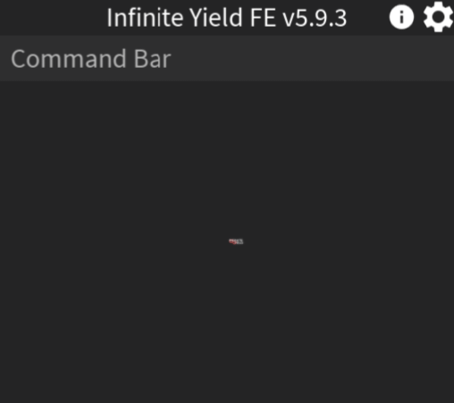

## Why does the script not load?

!!! example "File Corruption"
	1. Go into the folder where your executor is located
	2. Look for a folder named `workspace`
	3. Go into the folder named `workspace`
	4. Find the file named `IY_FE.iy` and delete it
	5. Join a game and execute Infinite Yield
	
	This will delete all your saved Infinite Yield settings (Prefix, Waypoints, etc.)

## Why do some commands not work on (game name)?

Lots of Roblox games have anticheats in place to prevent players from using scripts to gain an unfair advantage over other players. These anticheats work by detecting and preventing players from using unauthorized or malicious software or code that could alter the game in some way, such as by giving a player unlimited resources, superpowers, or other benefits that are not available to other players.

There are a few reasons why developers might implement an anticheat in their games:

`To ensure a fair and balanced gaming experience`: Anticheats help to level the playing field by ensuring that all players are playing by the same rules and that no one is able to gain an unfair advantage.

`To protect the integrity of the game`: Executors can disrupt the game's balance and undermine the game's overall quality, which can lead to player frustration and a decline in the game's popularity.

`To prevent exploitation of vulnerabilities`: Anticheats can help to prevent players from exploiting vulnerabilities in the game to gain an advantage or cause harm to other players.

## What about Byfron?

Why are people worrying about Byfron? Roblox only mentioned Byfron in order to address the concerns of investors.

Byfron is only compatible with Windows, and cannot be used on Mac, Linux, or mobile devices. The Microsoft Store version of Roblox is also unable to run Byfron. Byfron doesn't even work on Linux through wine.

Roblox makes even more money off of the community through scripts that require hats which cost Robux. Robux costs money. It can take a single Roblox employee to actually be dedicated every week to update Roblox to patch every executor for possibly days.

In conclusion, Byfron. The anticheat for only investors, will be most likely removed once Roblox's performance flops.

Thanks to Alex for all of this information.

## Why do some commands need a tool?

It simply requires a tool to function properly.

It needs a tool from the game itself that has a handle. An example of a handle is a sword. You hold the sword by it's handle which is usually an invisible block.

If there are no tools in the game then you can not use the command.

You can't spawn a tool in through a script.
